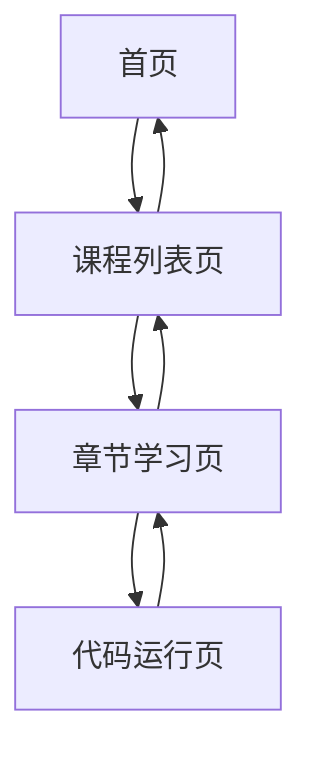

## 1. Product Overview
新中式国风风格的Python数据分析学习网站，提供免登录、全开放的在线学习平台，支持逐章逐节学习和在线Python代码运行。
- 解决用户无法逐章逐节学习、需要安装Python环境的问题，目标用户为Python初学者和数据分析爱好者
- 提供沉浸式的新中式学习体验，结合传统文化元素与现代技术教育

## 2. Core Features

### 2.1 User Roles (if applicable)
| Role | Registration Method | Core Permissions |
|------|---------------------|------------------|
| 普通用户 | 无需注册 | 访问所有课程、学习内容、使用代码编辑器 |

### 2.2 Feature Module
1. **首页**：国风风格展示、课程卡片、导航菜单
2. **课程列表页**：课程详情、章节概览
3. **章节学习页**：章节导航、小节内容、代码编辑器
4. **代码运行页**：在线Python环境、代码编辑、运行结果展示

### 2.3 Page Details
| Page Name | Module Name | Feature description |
|-----------|-------------|---------------------|
| 首页 | 导航栏 | 网站标题、课程导航、返回首页按钮 |
| 首页 | 课程卡片 | 展示Python相关课程（基础、Pandas、数据可视化），包含课程名称、简介、章节数 |
| 课程列表页 | 课程信息 | 课程标题、简介、学习进度 |
| 课程列表页 | 章节导航 | 左侧章节/小节列表，可点击切换，显示完成状态 |
| 课程列表页 | 学习内容 | 右侧当前小节的学习内容，包含理论知识、示例代码 |
| 章节学习页 | 代码编辑器 | 可编辑的代码区域，支持复制、运行功能 |
| 章节学习页 | 运行结果 | 显示代码执行结果，支持Pandas、NumPy、Matplotlib等库 |
| 章节学习页 | 进度保存 | 使用localStorage保存学习进度，刷新页面后保持 |
| 代码运行页 | 在线Python环境 | 使用Pyodide实现在线运行，无需后端支持 |

## 3. Core Process
用户访问网站 → 浏览首页课程卡片 → 点击课程进入章节列表 → 选择小节开始学习 → 查看学习内容 → 在代码编辑器中编写/运行代码 → 查看运行结果 → 标记小节完成 → 继续学习下一小节

## 4. User Interface Design
### 4.1 Design Style
- 主色调：米白（#F7F5F0）、青黛蓝（#4A6B8A）、墨黑（#2C2C2C）、浅灰（#E0E0E0）
- 按钮风格：微圆角（4px），青黛蓝底色，白色文字，悬停效果
- 字体：无衬线字体，主标题18-24px，副标题16px，正文14px
- 布局风格：卡片式设计，充足留白，简约中式线条装饰
- 图标风格：简约线条图标，结合中式元素

### 4.2 Page Design Overview
| Page Name | Module Name | UI Elements |
|-----------|-------------|-------------|
| 首页 | 课程卡片 | 米白底色，青黛蓝边框，微圆角，内部文字墨黑，悬停时轻微阴影效果 |
| 课程列表页 | 章节导航 | 左侧固定宽度，浅灰背景，当前章节青黛蓝高亮，完成章节标记 |
| 课程列表页 | 学习内容 | 右侧自适应宽度，米白背景，内容区域有充足留白，代码块使用浅灰背景 |
| 章节学习页 | 代码编辑器 | 浅灰背景，语法高亮，青黛蓝边框，运行按钮为青黛蓝 |
| 章节学习页 | 运行结果 | 白色背景，边框，显示代码执行结果，错误信息红色提示 |

### 4.3 Responsiveness
- 桌面优先设计，支持响应式布局
- 移动端适配：导航栏折叠为汉堡菜单，章节导航改为顶部标签栏，代码编辑器自适应宽度
- 触摸优化：按钮和可点击元素尺寸适合触摸操作

### 4.4 3D Scene Guidance (if applicable)
- 无3D场景需求