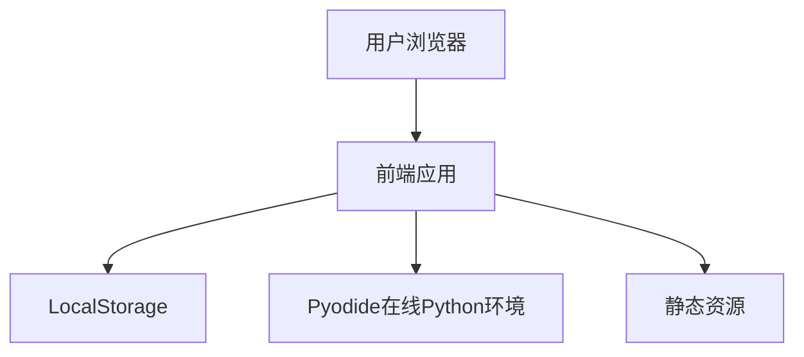
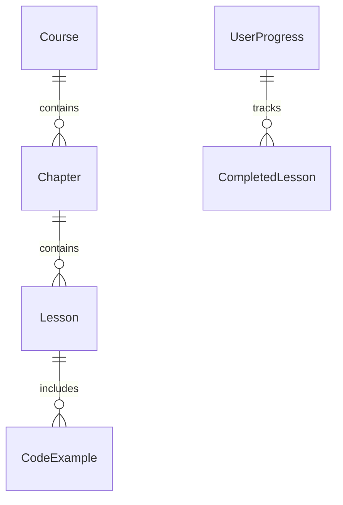

## 1. Architecture Design


## 2. Technology Description
- Frontend: React@18 + TypeScript + Tailwind CSS + Vite
- Initialization Tool: Vite
- Backend: None (纯前端实现)
- Database: LocalStorage (本地存储学习进度)
- Online Python Environment: Pyodide

## 3. Route Definitions
| Route | Purpose |
|-------|---------|
| / | 首页，展示课程卡片 |
| /courses | 课程列表页 |
| /courses/:courseId | 课程详情页 |
| /courses/:courseId/chapters/:chapterId | 章节学习页 |
| /courses/:courseId/chapters/:chapterId/lessons/:lessonId | 小节学习页 |

## 4. API Definitions (if backend exists)
- 无后端API需求，所有功能纯前端实现

## 5. Server Architecture Diagram (if backend exists)
- 无后端服务器需求

## 6. Data Model
### 6.1 Data Model Definition


### 6.2 Data Definition Language
#### 课程数据结构
```typescript
interface Course {
  id: string;
  title: string;
  description: string;
  modules: Module[];
}

interface Module {
  id: string;
  name: string;
  lessons: Lesson[];
}

interface Lesson {
  id: string;
  title: string;
  content: string;
  codeExample: string;
  difficulty: 'beginner' | 'intermediate' | 'advanced';
}

interface UserProgress {
  completedLessons: string[];
  currentCourse: string | null;
  currentChapter: string | null;
  currentLesson: string | null;
}
```

#### 本地存储结构
- Key: `python-learning-progress`
- Value: JSON string of UserProgress object

## 7. Technical Implementation Details
### 7.1 Pyodide Integration
- 使用Pyodide实现在线Python运行环境
- 支持Pandas、NumPy、Matplotlib等数据分析库
- 代码编辑器使用Monaco Editor或CodeMirror

### 7.2 响应式设计
- 使用Tailwind CSS的响应式类实现不同屏幕尺寸的适配
- 移动端导航栏折叠为汉堡菜单
- 章节导航在移动端改为顶部标签栏

### 7.3 性能优化
- 代码分割和懒加载
- 图片优化和缓存
- Pyodide库的按需加载

### 7.4 浏览器兼容性
- 支持现代浏览器（Chrome、Firefox、Safari、Edge）
- 针对IE浏览器的降级处理

### 7.5 部署方案
- 静态网站部署，无需后端服务器
- 所有文件放在同一文件夹，双击HTML即可运行
- 支持部署到GitHub Pages、Netlify等静态托管服务